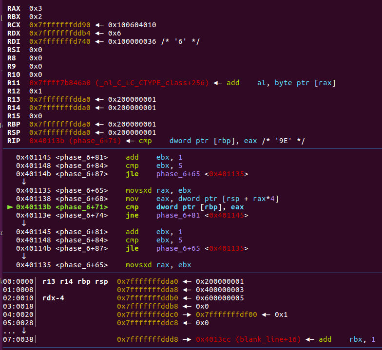
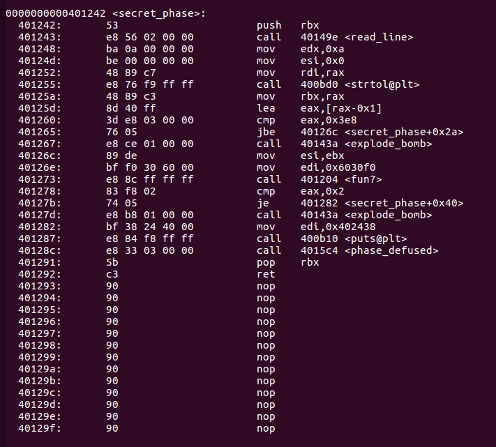

## Bomb Lab 笔记

### lab介绍

“二进制炸弹”是一个作为目标代码文件提供给学生的程序。在运行时，它提示用户输入6个不同的字符串。如果其中任何一项不正确，炸弹就会“爆炸”，打印错误信息并在评分服务器上记录事件。学生们必须通过拆卸和逆向工程程序来“拆除”他们自己独特的炸弹，以确定这6根弦应该是什么。该实验室教学生理解汇编语言，并强迫他们学习如何使用调试器。这也很有趣。在卡内基梅隆大学的本科生中是一个传奇的实验室。

下面是一个Linux/x86-64二进制炸弹，您可以自己尝试一下。通知评分服务器的功能已经被禁用，所以你可以自由地引爆这个炸弹而不受惩罚。如果你是一名拥有CS:APP账户的教师，那么你可以下载解决方案。（官网机翻，看懂了是要逆向bomb程序，有六关）

### 笔记

#### phase1

先objdump -d -mi386:x86-64:intel bomb 找到main函数的位置，可以粗略看出这六个关卡的地址，分别是

```
call   400ee0 <phase_1>
call   400efc <phase_2>
call   400f43 <phase_3>
call   40100c <phase_4>
call   401062 <phase_5>
call   4010f4 <phase_6>
```


用gdb 调试bomb，直接在0x400e3a下断点，需要输入，直接键入aaaaaa然后回车，断到了第一关的位置。


对于x64体系结构，如果函数参数不大于6个时，使用寄存器传参，对于函数参数大于6个的函数，前六个参数使用寄存器传递，后面的使用栈传递。参数传递的规律是固定的，即前6个参数从左到右放入寄存器: rdi, rsi, rdx, rcx, r8, r9，后面的依次从 “右向左” 放入栈中。这里可以看出输入的aaaaaa被当作参数传递到了rdi寄存器，步入函数phase_1


进入函数后，函数的符号很齐全，string_not_equal 功能是比较字符串，explode_bomb是炸弹被引爆了闯关失败，这里关键就是要string_not_equal 函数返回结果eax为1才能让je指令跳转，跳过explode_bomb爆炸，所以需要看下输入的字符串和哪个字符串进行比较。


这里是小端序16进制，把0x402400的内容直接按照字符串打印出来：


第一关的答案就出来了

```
Border relations with Canada have never been better.
```


#### phase2

删除之前的断点，然后第二关0x400efc上下断点，运行bomb，输入第一关的flag，然后到了第二关flag的输入，继续输入aaaaaa


发现在phase_2中，需要6个数字做输入，跟进去确实是sscanf读入了用空格间隔的6个整形数字，如果输入数量不够就直接爆炸。重新输入0 1 2 3 4 5做测试输入，重来。


输入的每个数字占4个字节，然后看到第一个是拿栈顶和1比较，说明栈顶此时存放的必须是1不然就爆炸，说明第一个数字固定是1。


查了下资料，这里如果想要je指令跳过explode_bomb，用info registers 看下标志寄存器eflags ，需要把16进制转为二进制，然后把ZF置为1，在转回16进制，最后set $eflag就行


然后继续看后续操作，eax * 2 的结果和ebx寄存器值作比较，eax是我们的第一个输入，ebx存放的是第二个输入，如果不相等就会爆炸，之后有一个jne跳转 rbx和rbp不相等继续比较下一个数字，意思就是前一个数*2 必须等于后一个数才行，如果第一个数字规定了为1，那后面就得是1 2 4 8 16 32


第二关的答案

```
1 2 4 8 16 32
```


#### phase3

删除之前的断点，然后第三关0x400f43上下断点，可以看出要求输入两个整形，输入错误就会爆炸


然后把[rsp+8] 也就是第一个输入和7比较，JG是无符号数比较，大于则跳转，动调后发现输入的第一个数如果大于7就直接爆炸，说明输入的数字必须小于7才行，这里有点跳跃用objdump看下第三关整体


看了下逻辑，rax是第一个输入的值，会跳转到 [rax*8 + 0x402470]，接下来把输入第二个数和一个固定值比较，不一样会爆炸，我输入的是1，之后就会跳转到0x402478，第二个值和0x137作比较，所以这关有多解

```
0x400f75 <phase_3+50>     jmp    qword ptr [rax*8 + 0x402470]
```


第三关的答案：

    0 207
    1 311
    2 707
    3 256
    4 389
    5 206
    6 682
    7 327
#### phase4

第四关也是输入两个数字，比较输入的第一个数要小于0xe，输入错误会爆炸，然后进入到func4函数中进行其他操作。


经过动调发现，func4先计算了 0xe - 0 >> 2 的结果，得到7，然后把7和第一个输入作比较，如果大于或者小于就进行func4递归，如果等于就将返回值eax置为0，正好最后的判断就是比较返回值eax == 0 和 第二个输入 == 0 ，不满足条件就爆炸，所以可以输入 7 0 做为第四关答案。


第四关的答案可以为：

```
7 0 
```

#### phase5

上来就比较输入的字符串长度，不等于6就爆炸


之后把输入字符串的第一个字节拿出来，ASCII码和0xf 做与运算，得到1，拿到0x4024b0中做偏移量，我这里输入的第一个为a，所以最后取的值为地址0x4024b1的值，也是0x61。。。然后循环挨个字符串都做相同操作，把结果保存到了栈上


最后是字符串比较，结果需要是flyer，写个脚本逆推解决下：


```
a = [0x6D, 0x61, 0x64, 0x75, 0x69, 0x65, 0x72, 0x73, 0x6E, 0x66, 0x6F, 0x74, 0x76, 0x62, 0x79, 0x6C]
b = "flyers"
flag = ""
for i in range(len(b)):
	for j in range(len(a)):
		if b[i] == chr(a[j]):
			flag += chr(j+0x60)
print (flag)
```

第五关结果可以为

```
ionefg
```

#### phase6

第六关需要输入6个数字，首先是一个循环判断这六个数字互不重复



然后用7 - 每个输入的数字，得到的结果覆盖到栈上输入的数字，我测试的数字是1 2 3 4 5 6 ，结果得到6 5 4 3 2 1


然后开始取出node，node是个链表结构，从下面的内存可以看出，一个node由16个字节组成，每个node有序号，内容和下一个节点的地址。


| 序号  | 地址     | 值    |
| ----- | -------- | ----- |
| node1 | 0x6032d0 | 0x14c |
| node2 | 0x6032e0 | 0xa8  |
| node3 | 0x6032f0 | 0x39c |
| node4 | 0x603300 | 0x2b3 |
| node5 | 0x603310 | 0x1dd |
| node6 | 0x603320 | 0x1bb |

可以看出取出node的顺序，是按照之前 7 - 我们的输入的值的顺序来的，第一个是6 所以第一个放入的是node6，最后放入qword ptr [rsp + rsi*2 + 0x20]的顺序也是node6 5 4 3 2 1，最后把节点的下一条地址也按照6 5 4 3 2 1的顺序来放置


然后把值取出来，比大小，从如果当前节点的值的大小没有大于后一个节点，就会爆炸。所以分析到这里就可以知道，前面的操作相当于对节点进行一个从大到小的一个排序，应该是3 4 5 6 1 2    由于次序是用7 - 我们输入的数来排的，所以最后结果应该是 4 3 2 1 6 5


第六关结果为

```
4 3 2 1 6 5
```


#### secret_phase

在objdump里，还有一个隐藏关，需要在0x401630处触发




需要通过前六关才能到隐藏关


触发条件是第四关输入时是7 0 字符串 这样的格式，并且字符串必须是DrEvil


C 库函数 **long int strtol(const char \*str, char \**endptr, int base)** 把参数 **str** 所指向的字符串根据给定的 **base** 转换为一个长整数

- **str** -- 要转换为长整数的字符串。
- **endptr** -- 对类型为 char* 的对象的引用，其值由函数设置为 **str** 中数值后的下一个字符。
- **base** -- 基数，必须介于 2 和 36（包含）之间，或者是特殊值 0。

输入的字符串转为10进制的数字，这里必须小于等于0x3e8 才不会爆炸


然后调用fun7函数，只有fun7返回值为2时，才能避免炸弹爆炸


进入func7函数，第一个参数传的是一个地址0x6030F0，根据动调的结果，可以看出是一个二叉树结构，n1为根节点，nab为第a层第b个节点


则其返回的模式必须为2 * (1+2 * 0)，所以输入的数字须得等于n32节点中的值22

