## CSAPP学习笔记

#### 冯诺依曼结构的主要思想

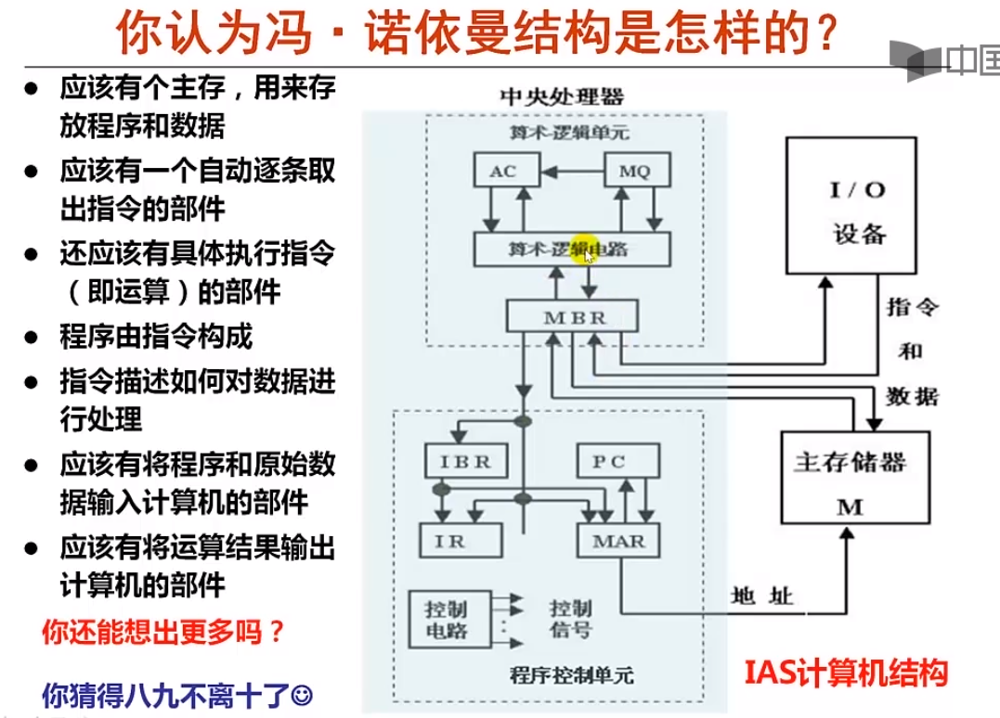

早期部件之间用分散方式相连，现在部件之间大多用总线方式相连，下图为冯诺依曼结构的模型：

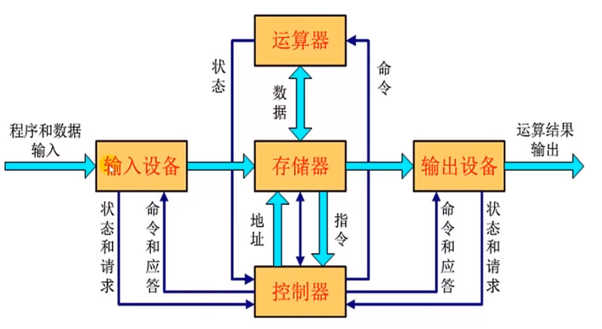

计算机由运算器，控制器，存储器，输入设备，输出设备五个基本组件组成，这种结构方式规定了计算机能自动处理程序。

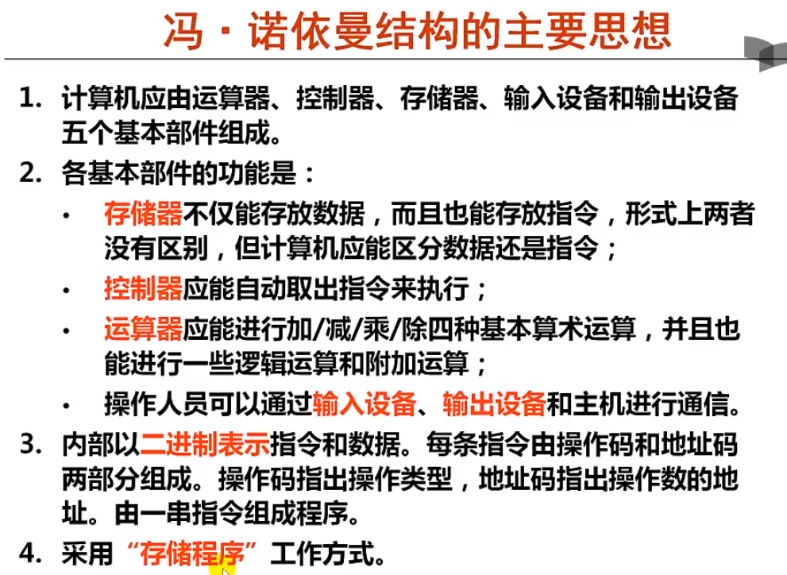


#### 现代计算机结构模型

ALU 算术逻辑单元arithmetic and logic unit是能实现多组算术运算和逻辑运算的组合逻辑电路，简称ALU

MAR的英文全称为Memory Address Register，其中文名为地址寄存器。

MDR的英文全称为Memory Data Register，其中文名为数据寄存器。

MAR（地址寄存器）的作用是：用来存放预访问的存储单元的地址，其位数对应存储单元的个数。

MDR（数据寄存器）的作用是：是存储器数据寄存器，用来存放从存储体某单元取出的代码。

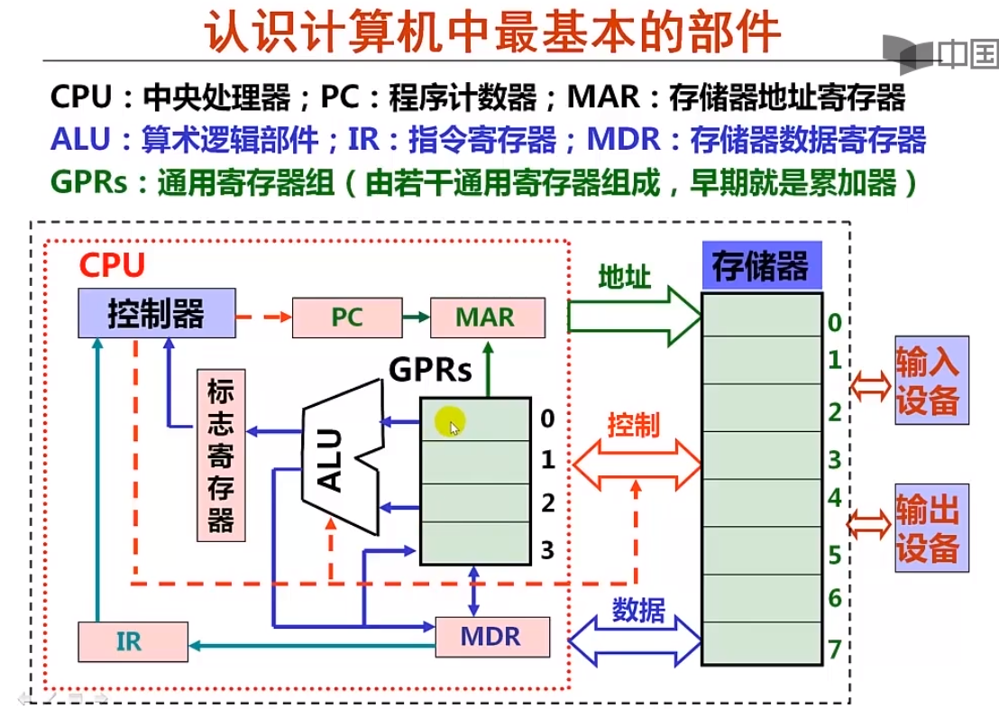

工作链像是工厂，厨房


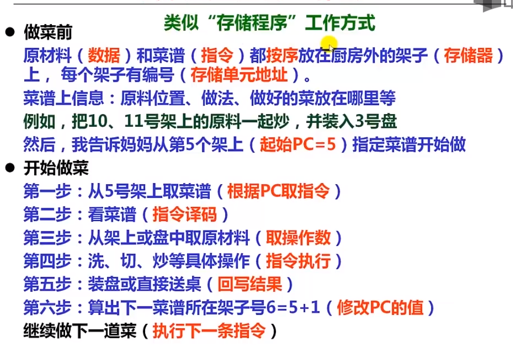

计算机指令执行过程：

程序中第一条指令的地址置于PC 中，根据PC 取出第一条指令，经过译码、执行步骤等，控制计算机各功能部件协同运行，完成这条指令的功能，并计算下一条指令的地址。用新得到的指令地址继续读出第二条指令并执行，直到程序结束为止。

存储程序的工作方式：计算机自动从程序中取出一条条指令运行，执行过程中无需人的干预


#### 从机器语言到高级编程语言

机器语言：由二进制0，1表示。

汇编语言：用助记符符号来表示，与机器指令一一对用。

高级语言：面向算法描述，有面向过程和面向对象的语言之分，有两种转换方式编译和解释。

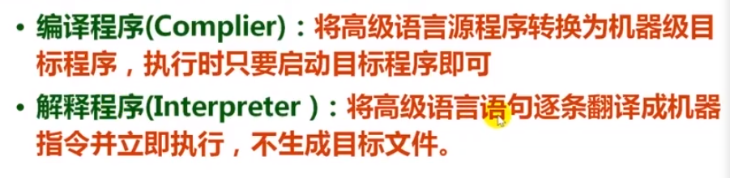


#### 程序的开发执行

源程序要经过 预处理 编译 汇编 链接的操作，生成可执行程序

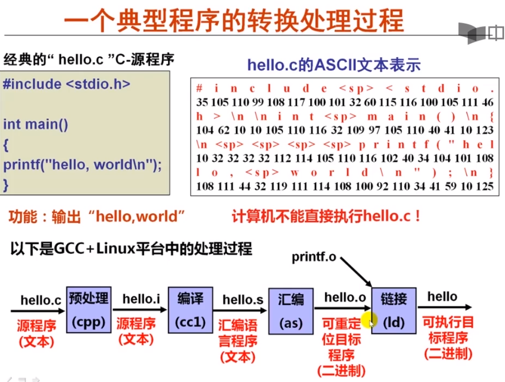

可执行程序执行的流程图：

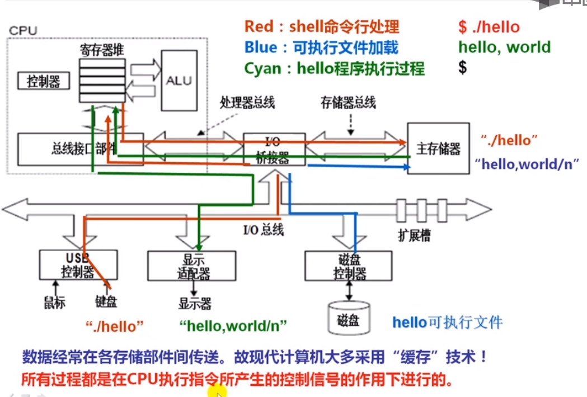

所有的汇编指令都和机器码一一对应：

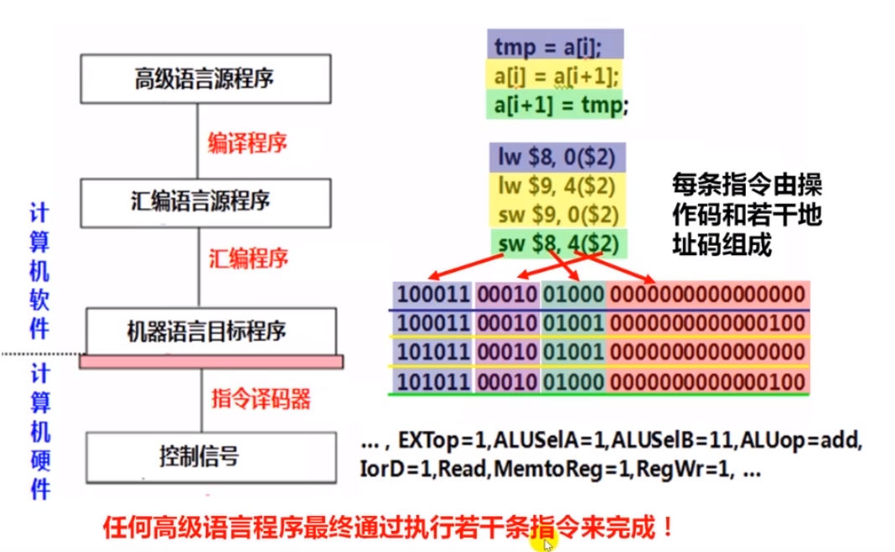


#### 现代计算机的层次结构

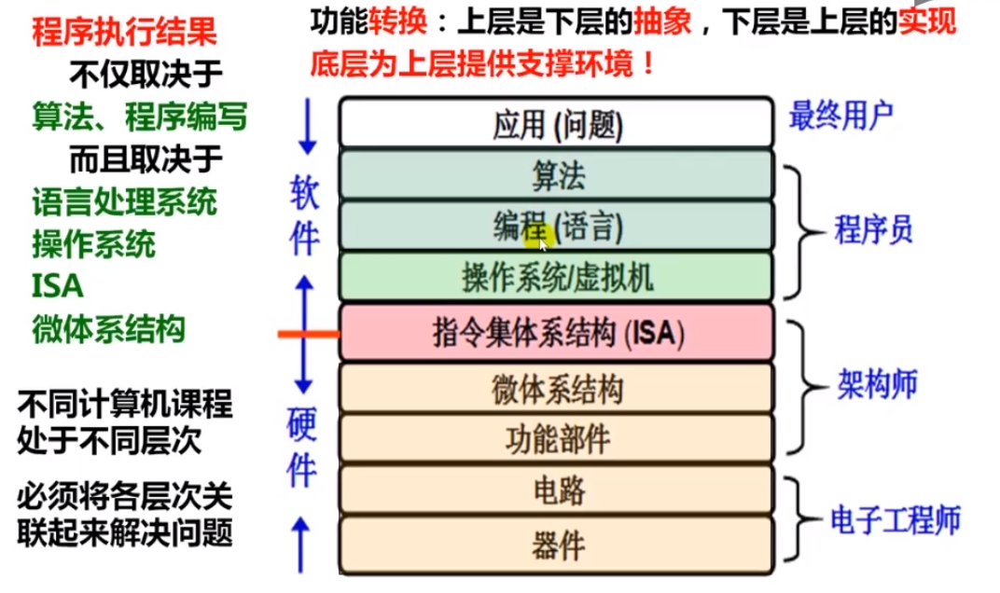

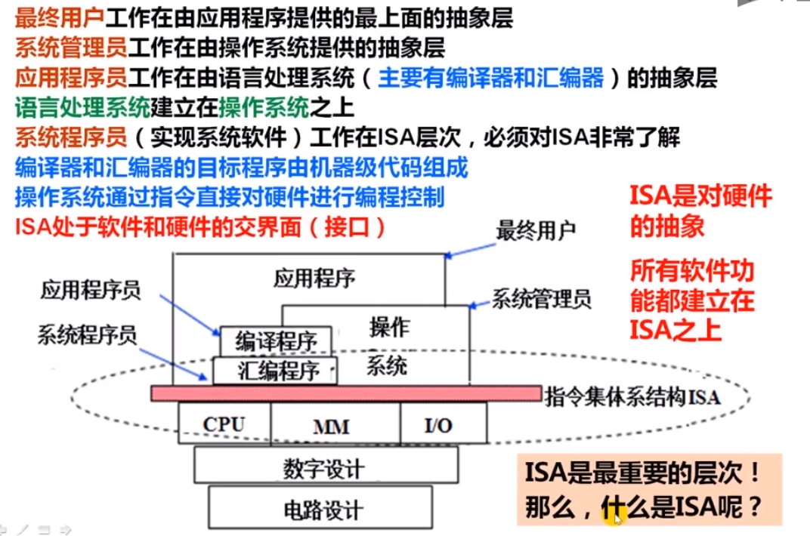

指令集体系结构ISA（Instruction Set Architecture）是一种规约，它规定了如何使用硬件

- 可执行的指令集合，包括指令格式，操作总类
- 指令可以接受的操作数类型
- 操作数所能存放的寄存器组和结构，包括每个寄存器名称、编号、长度和用途等
- 操作数所能存放的存储空间大小和编址方式
- 操作数存储按照大端还是小端方式存放
- 寻址方式，指令执行的控制方式，包括程序计数器，条件码定义
- 不同ISA规定的指令集不同，如IA32，MIPS，ARM等
- 同一种ISA可以有不同的计算机组成，如乘法指令可以用ALU或乘法器实现


#### 进制转换

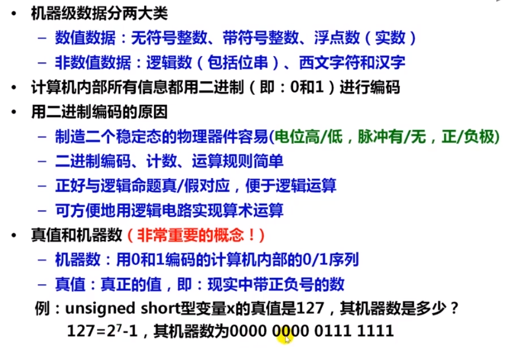

R进制，逢R进1

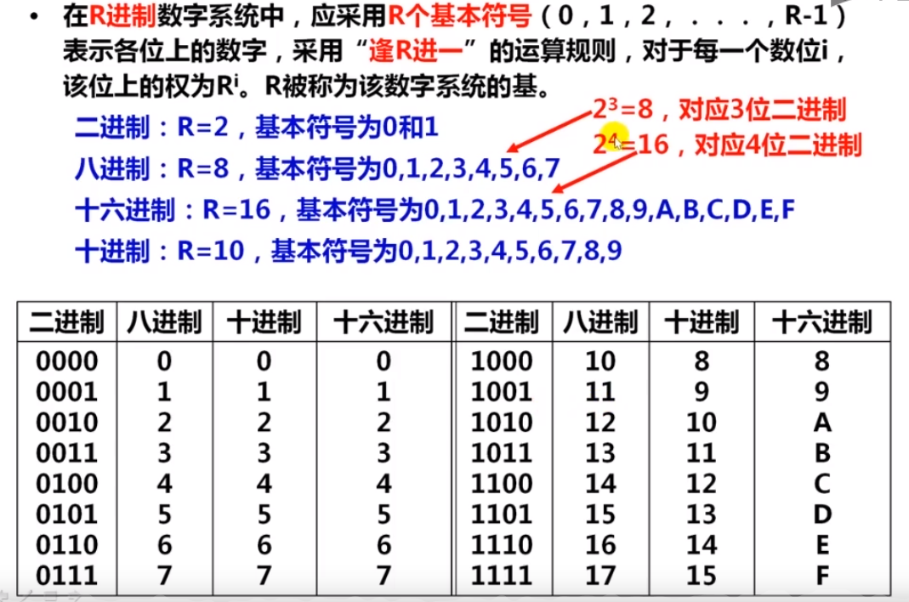

十六进制是二进制的简化表示，便于阅读和书写

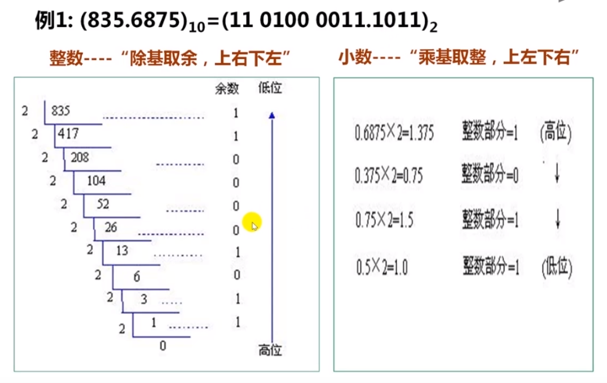

在小数部分转换的时候可能总得不到0，此时得到一个近似值说明现实中的精确值在机器内部无法用0和1精确表示

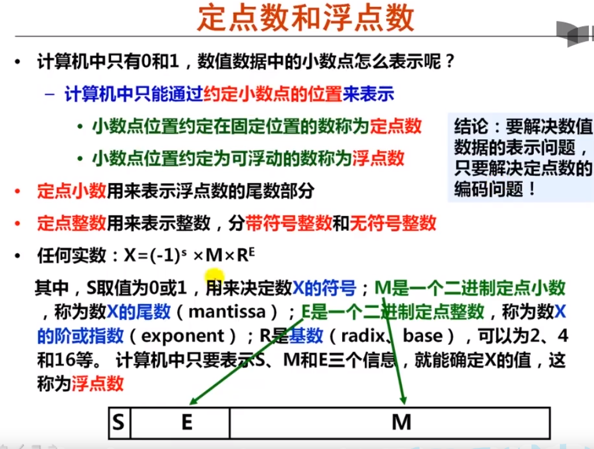


#### 原码和移码表示

**原码：**

如果机器字长为n，那么一个数的原码就是用一个n位的二进制数，其中最高位为符号位：正数为0，负数为1。剩下的n-1位表示概数的绝对值。 

例如： X=+101011 , [X]原= 00101011   X=-101011 , [X]原= 10101011 

位数不够的用0补全。 

PS：正数的原、反、补码都一样。 

**反码：**

 知道了什么是原码，那反码就更是张飞吃豆芽——小菜一碟了。知道了原码，那么你只需要具备区分0跟1的能力就可以轻松求出反码，为什么呢？因为反码就是在原码的基础上，符号位不变其他位按位取反(就是0变1，1变0)就可以了。 

例如：X=-101011 , [X]原= 10101011 ，[X]反=11010100 

**补码：**

补码也非常的简单就是在反码的基础上按照正常的加法运算加1。

例如：X=-101011 , [X]原= 10101011 ，[X]反=11010100，[X]补=11010101 

**移码：**

移码最简单了，不管正负数，只要将其补码的符号位取反即可。

例如：X=-101011 , [X]原= 10101011 ，[X]反=11010100，[X]补=11010101，[X]移=01010101

**功能与目的**

反码：解决负数加法运算问题，将减法运算转换为加法运算，从而简化运算规则；

补码：解决负数加法运算正负零问题，弥补了反码的不足。

总之，反码与补码都是为了解决负数运算问题，跟正数没关系，因此，不管是正整数还是正小数，原码，反码，补码都全部相同。

原码、反码、补码都是有符号定点数的表示方法（日常生活中通常都使用有符号数，定点数对应的就是浮点数，即小数），反码、补码是为了简化二进制数的减法运算；

移码常用来比较大小，一般会把浮点数的阶码用移码表示，说的再通俗一点，你把数值用移码表示出来可以一眼看出他们的大小。这样很容易判断阶码的大小，移码可用于简化浮点数的乘除法运算。

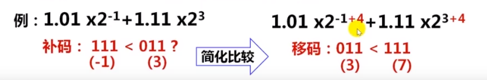


#### 模运算系统和补码表示

在计算机中，减法可以用加法来代替，用的就是补码。说到补码，就得说到“模”这个概念。假如我有一个计算机，它只有四个bit，这四个bit所能表示的值的范围用二进制表示是0000到1111，即从0到15。这样，这个计算机就只能表示这16个数，别的东西它就无法表示了。这个16就是这个计算机的“模”，在这个计算机上进行的计算只能在“模”的表示范围之内。


如果我们要计算5-3的值，我们既可以用5减去3，也可以用5加上13。这是为什么呢？这就像我们的钟表，它从1点走到12点之后，又回到了1点。我们的计算机也是，从0走到15之后，再往下走就又回到了0，就像我们转了一个圈一样。我们从5这个位置往回退3个格，就完成了5-3这个计算。我们也可以从5这个位置往前走，一直走到15，这时我们走了10个格，然后我们继续往前走，走到0，然后到1，然后就走到了2。这样，我们往前走了13个格之后，也到了2这个位置。所以说，在我们这个计算机中，减3和加13是一样的。而3+13=16，我们说在模16的系统下，3和13是互补的。


这样，我们计算5-3就可以换成5+13。3的二进制表示为0011，5的二进制表示为0101。这样，0101-0011就可以表示为0101+（-0011）。我们在计算机中都是把负数用其补码表示，-0011的补码就是10000-0011（即16-3，也就是13）。10000-0011=1+1111-0011=1+（1111-0011）=1+1100=1101。我们总说补码是“按位取反再加一”，看了上面这个式子相信大家就会明白了，其实就是把10000-0011换成了1111-0011再加1的形式。然后，0101-0011就换成了0101+1101，它们计算出来的结果为10010。由于我们的计算机只有四个bit，所以结果为0010。即，在模16的计算机中，5-3=5+13=2


#### 补码和真值的对应关系

当机器数为8位，求真值补码和求补码真值如下图：

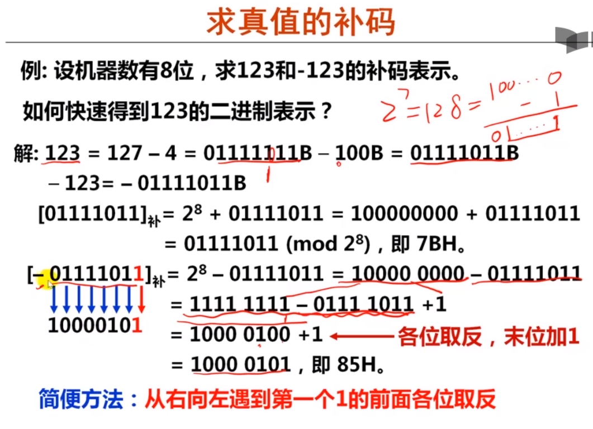

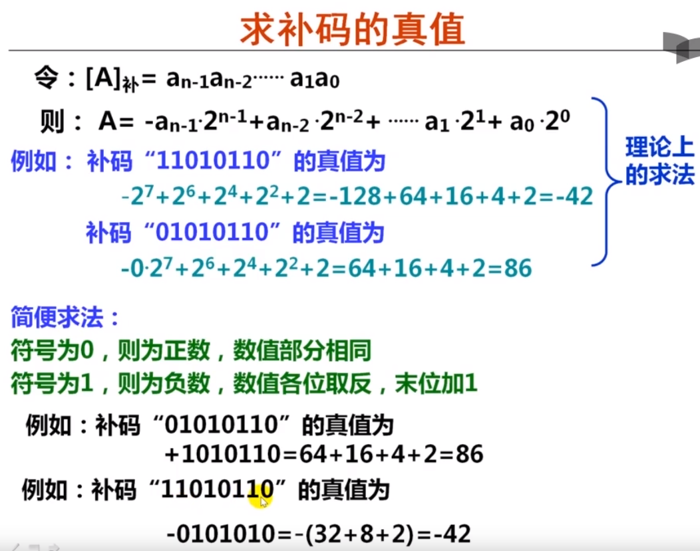


#### 无符号整数和带符号整数

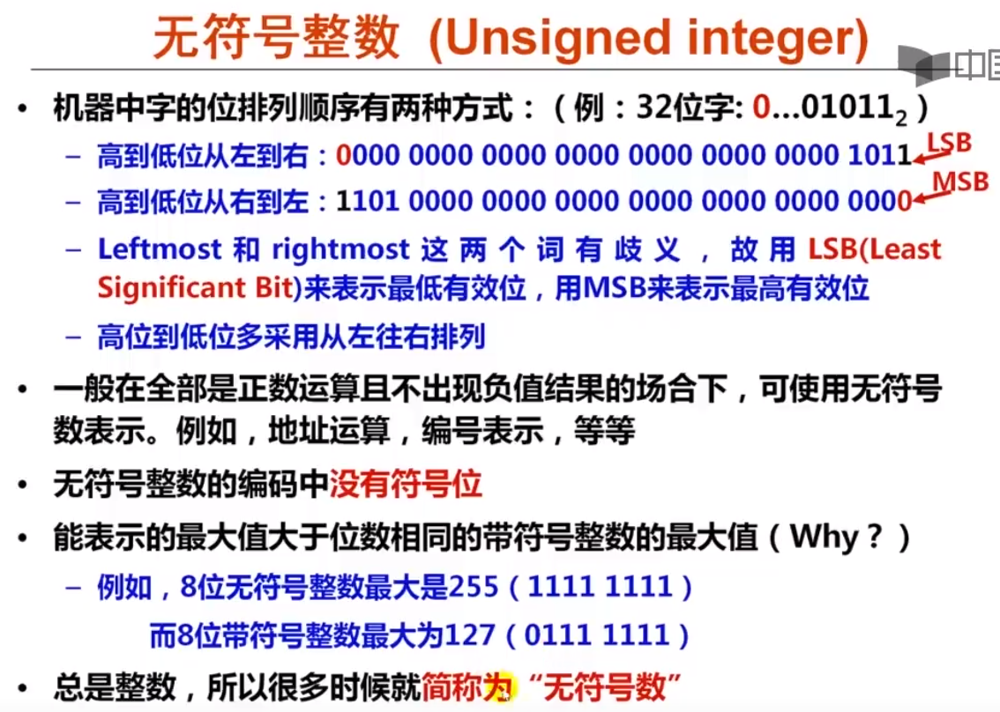

在C语言做运算比较时，如果拿无符号和有符号数进行操作，会强行类型转换为无符号类型，会出现以下这些情况，负数没了符号位，会变成一个大的正数。

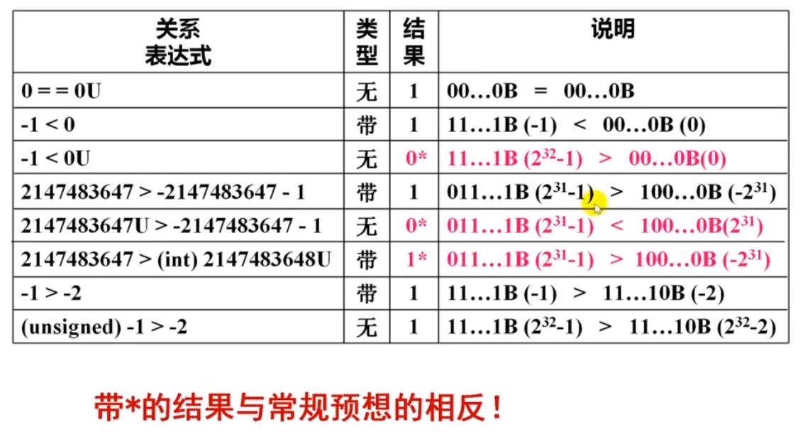


#### C语言程序中整数举例

```
#include <stdio.h>

int main()
{
	int x = -1;
	unsigned u = 2147483648;
	printf("x=%u=%d\n",x,x);
	printf("u=%u=%d\n",u,u);
	return 0;
}
```

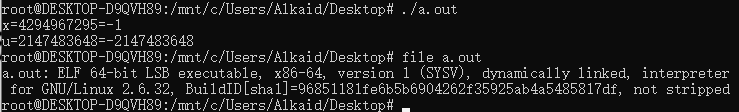

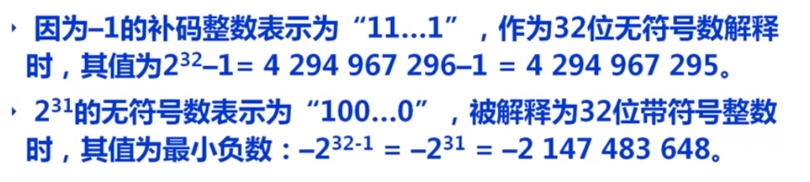

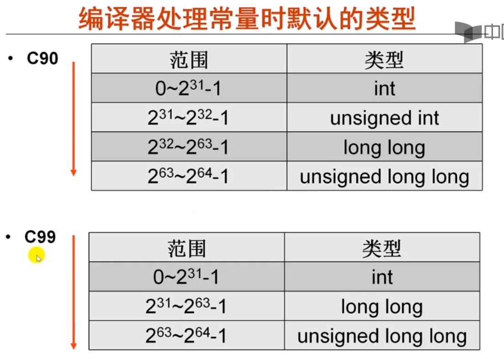

在C90和C99标准下：

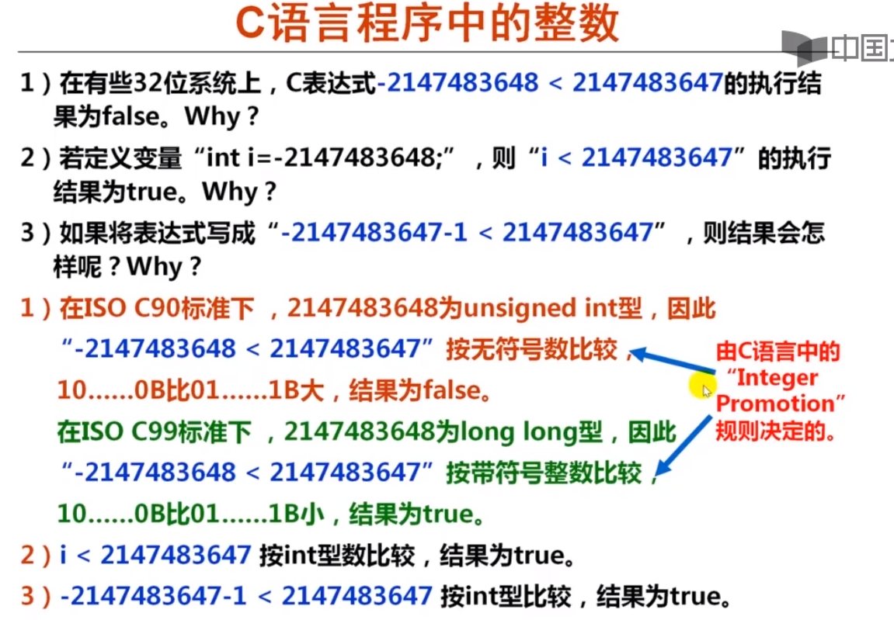


#### 浮点数的表示范围

把一个数的有效数字和数的范围在计算机的一个存储单元中分别予以表示。这种把数的范围和精度分别表示的方法，相当于数的小数点位置随比例因子的不同而在一定范围内可以自由浮动，所以称为**浮点表示法**。

在计算机中一个任意二进制数N可以写成： N=2^e.M
其中M称为浮点数的尾数，是一个纯小数。e是比例因子的指数，称为浮点数的指数，是一个整数。比例因子的基数2对二进记数制的机器是一个常数。
在机器中表示一个浮点数时，一是要给出尾数，用定点小数形式表示。尾数部分给出有效数字的位数，因而决定了浮点数的表示精度。二是要给出指数，用整数形式表示，常称为阶码，阶码指明小数点在数据中的位置，因而决定了浮点数的表示范围。浮点数也要有符号位。

| 符号位 | 阶码 | 尾数 |
| ------ | ---- | ---- |
| S      | E    | M    |

按IEEE754标准，32位浮点数和64位浮点数的标准格式为：

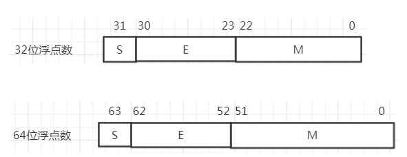

科学计数法表示实数：

十进制：12735 = 1.2735 * 10^4

二进制：1011.01 = 1.01101 * 2^3

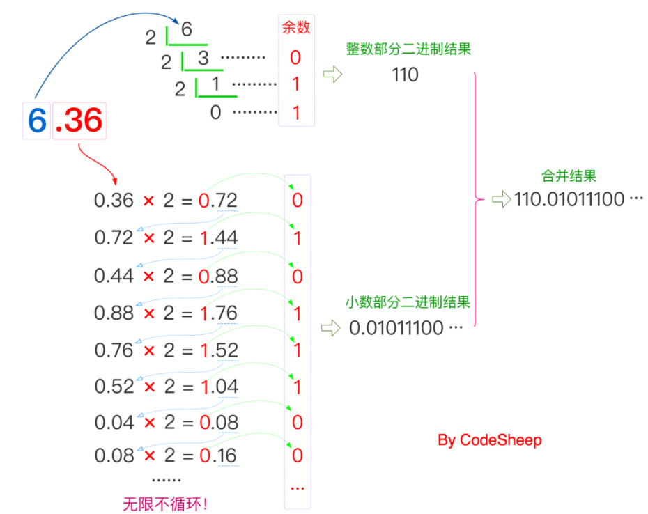

整数部分 + 小数部分，因此最终得到的结果二进制结果为`110.01011100...`。

还是按照上一节所述的**尾数 + 阶码**的计算机计数方式，则可以表示为：

1.1001011100 * 2^2

所以对应可得：

- **符号位**：0
- **阶码(E)部分**：若以`float`为例，应为 `127 +(2)= 129`，因此二进制表示为：`10000001`
- **尾数部分(M)**：`1001011100...`，其实它本身无限不循环，但若以`float`型精度来截取`23`位，则可以表示为`10010111000010100011111`

因此最终的总结果为(以`32`位精度`float`表示)：

```
01000000110010111000010100011111
```

所以像这种无限位数的尾数情况，用计算机存储产生截取是必然的，必定会有一定的**精度损失**！所以这也从根本上解释了为什么float或者double这种类型数据使用时的风险性，因此必须要结合实际业务理性考量。


#### IEEE 754中特殊数的表示

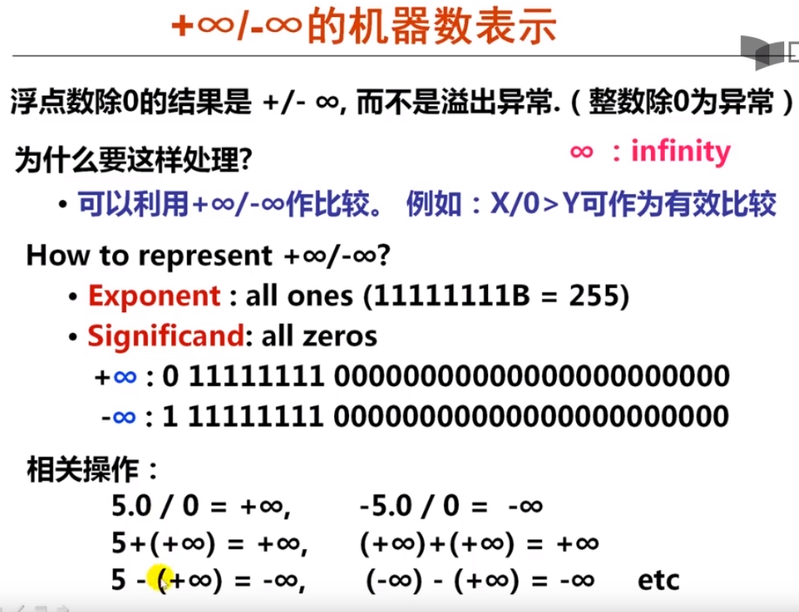

规格化值：exp不全是0也不全是1，则指数E=e-bias，e为exp的无符号数，bias为2k-1（float为k为8-1，double为11-1），则E的范围为-126127或-10221023。(与有符号数不一样，有符号数是负值多一个，主要原因是-1)。此时小数域frac，认为最高位默认值为1，小数域只存储小数域值（.以后的数）。

非规格化值：exp全为0时，e为0，但是指数E=1-bias（而非0-bias，为了平滑过渡，通过增加一个1，可以弥补非规格化数frac最高位没有的1），此时frac最高位为0，不为默认的1.好处1可以表示0，好处2可以表示接近0的数。

特殊值：exp全为1，小数域全为0，符号位为0时表示+∞，为1时可以表示-∞。小数域不为0时表示NaN。


#### 非数值数据的编码表示

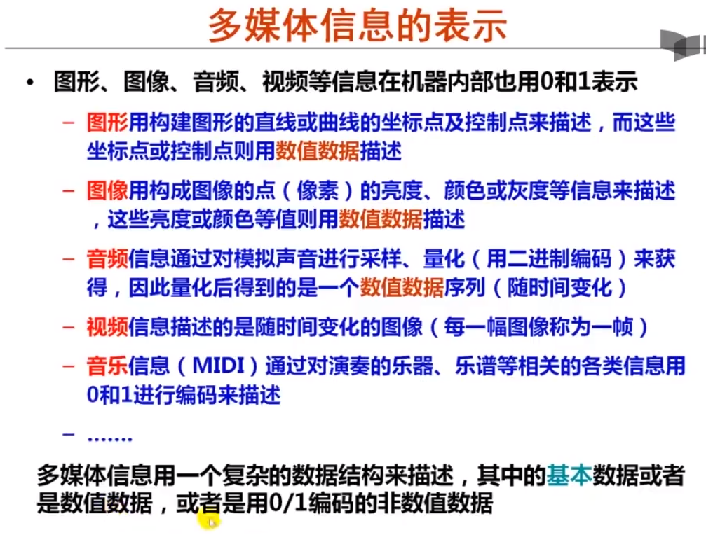


#### 数据的基本宽度

一般内存换算是1024进制，也就是2的10次方。

1TB=1024GB；

1GB=1024MB；

1MB=1024KB；

1KB=1024Byte。

Byte就是B也就是字节；

KB是千字节；

MB是兆；

GB是千兆；

一般情况把他们看作是按千进位就行，准确的是1024也就是2的10次方。

Bit 比特，一个二进制位，通信常用的单位。

Byte 字节，由八个二进制位组成，是计算机中表示存储空间的最基本容量单位。
K 千，存储空间的容量单位, kilobyte，1K=1024字节。
M 兆，megabyte,1M=1024K。

G 吉，gigabyte,1G=1024M。
T 太，1T=1024G。

B ：是计算机字节单位，一般用于存储，1K=1024B，1M=1024KB ，1G=1024MB；
b ：是网络字节流量的单位，计作，“bit”（比特）。

b是byte的意思,一字节.字节是数据传输的基本单位,是八位2进制数,00000000~11111111换算成十位数就是0~255。

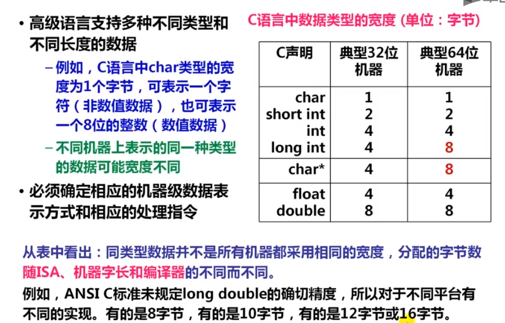


#### 数据存储时的字节排列

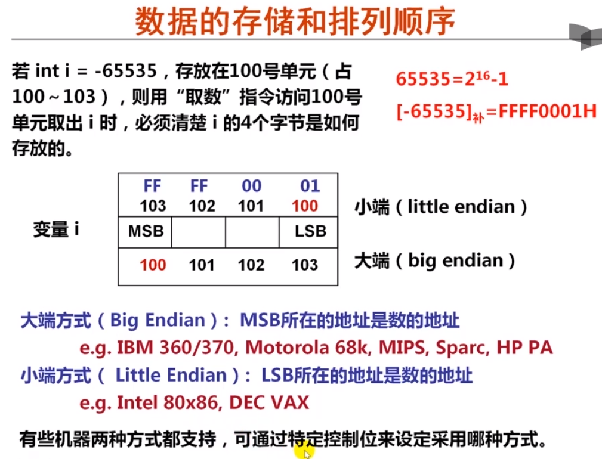

union的存放顺序是所有成员从低地址开始，利用这个特性测试CPU的大小端方式：

```
#include <stdio.h>

int main()
{
	union NUM
	{
		int a;
		char b;
	}num;
	num.a = 0x12345678;
	if(num.b == 0x12)
		printf("Big Endian\n");
	else
		printf("Little Endian\n");
	printf("num.b = 0x%X\n",num.b);
    return 0;
}
```

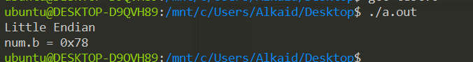


#### 数字逻辑电路基础

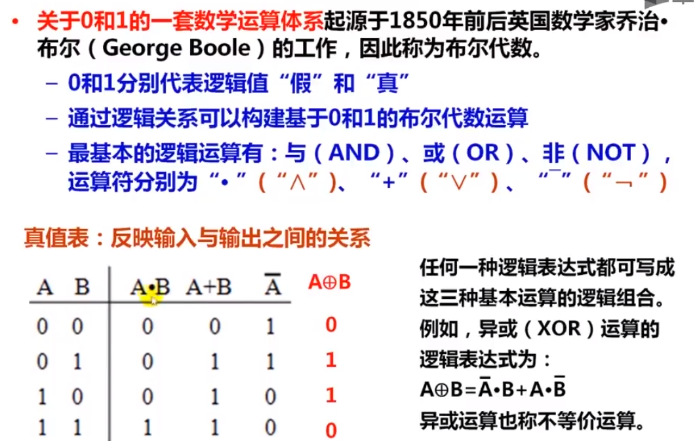

异或可以写成

a ^ b = ~a & b | a & ~b

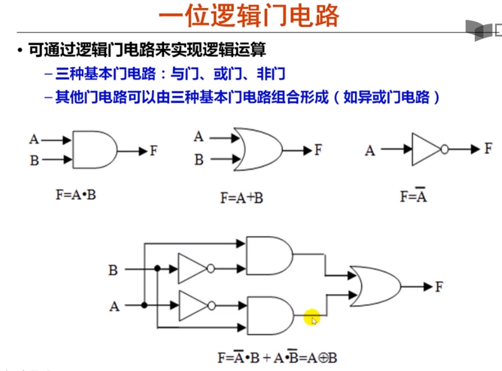


#### 无符号数加法器

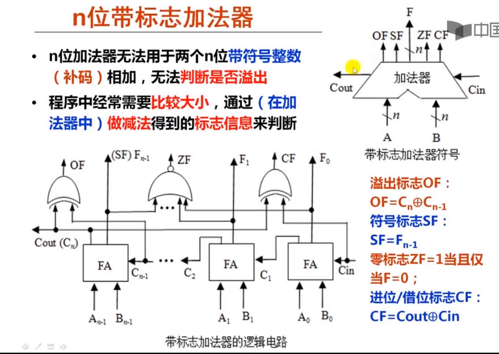

CF（进位标志） =1 算术操作最高位产生了进位或借位bai =0 最高位无进位或借位 ；

PF（奇偶标志） =1 数据最低8位中1的个数为偶数 =0 数据最低8位中1的个数为奇数；

AF（辅助进位标志） =1 D3→D4位产生了进位或借位 =0 D3→D4位无进位或借位；

ZF（零标志） =1 操作结果为0 =0 结果不为0；

SF（符号标志） =1 结果最高位为1 =0 结果最高位为0；

OF（溢出标志） =1 此次运算发生了溢出 =0 无溢出。

例如8位二进制数相加：1001 1100B+0001 1000B 结果为 1011 0100B 此时无进位CF=0，PF=1，AF=1，ZF=0，SF=1，OP=0。


#### 整数加减运算器与ALU

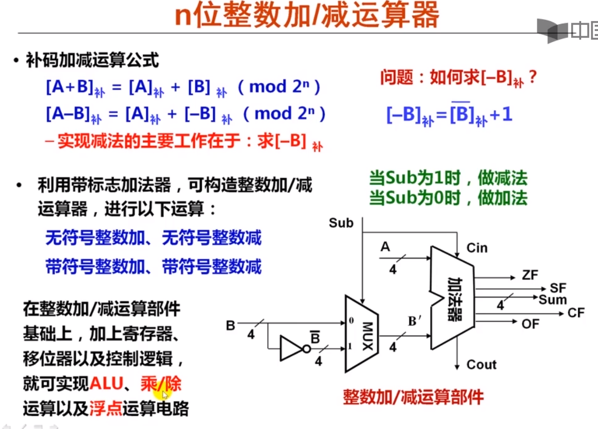

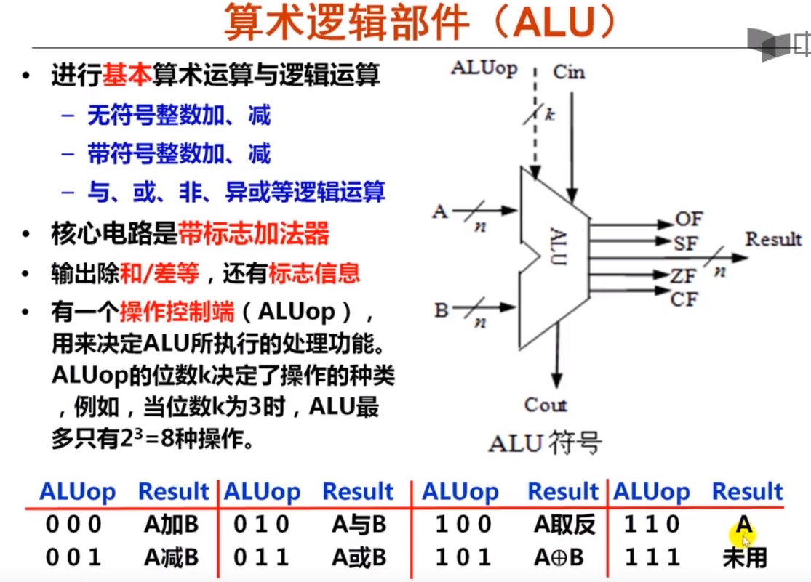

配合之前的知识，ALU获取到指令中的控制码，根据控制码得知要进行什么操作，然后从寄存器中获取操作数进行计算


#### 从C表达式到逻辑电路

C语言

 y = (x>>2) + K

汇编 

sarw $2,%ax;

addw %bx,%ax;

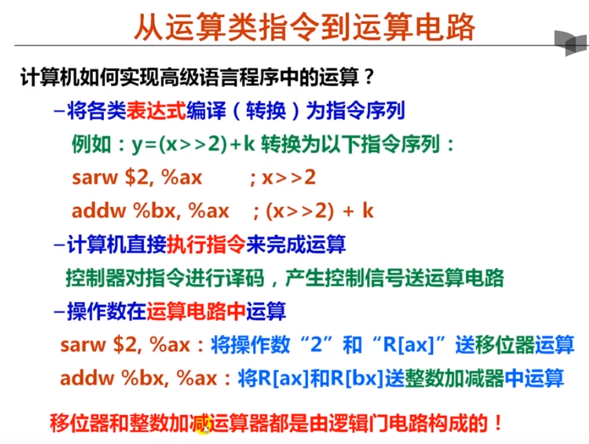


#### C语言的各类运算

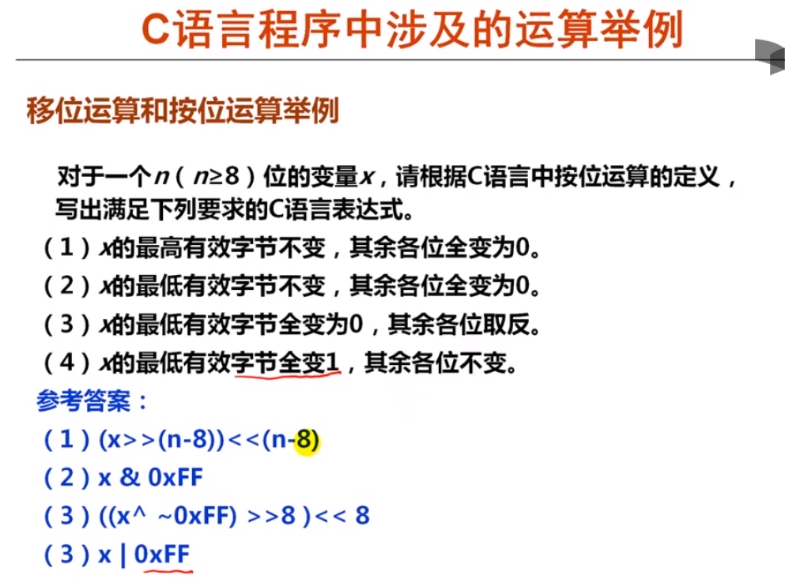

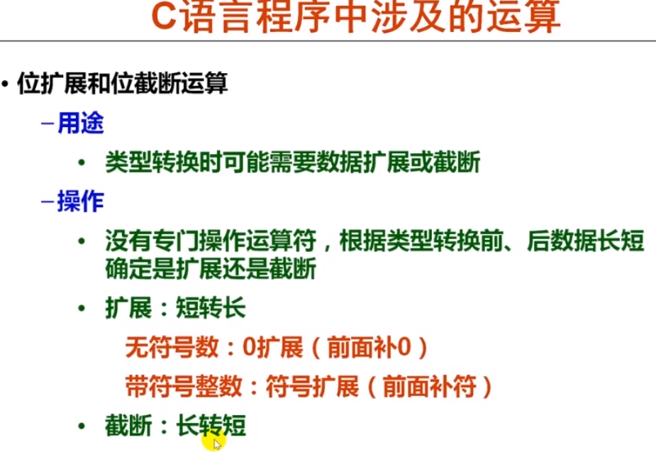


#### 整数加减法

对于无符号整数，x，y：

x+y=x+y, x+y<pow(2,w)

   x+y-pow(2,w), x+y>=pow(2,w)

 

对于有符号整数，x，y:

x+y=x+y,-pow(2,w-1)<=x+y<pow(2,w-1)

   x+y-pow(2,w), pow(2,w-1)<=x+y

   x+y+pow(2,w), x+y<-pow(2,w-1)
