## ShellLab Note

### 任务简述

该实验主要自己实现一个简易的shell，有一些难度，而且有些错误很难找，做完后感觉对shell有了更好的理解。

该实验在`tsh.c`文件中实现了大部分的框架，需要自己完成以下函数内容：

- eval：解析和解释命令行的主例程，大约70行。
- builtin_cmd：识别并解释内置命令：`quit`、`fg`、`bg`和`job`，大约25行。
- job：列出所有后台作业。
- waitfg：等待前台作业完成
- sigchld_handler：`SIGCHLD`信号的处理函数`
- sigint_handler：`SIGINT`信号的处理函数sigtstp_handler`：`SIGTSTP信号的处理函数 

我们希望实现的shell具有以下功能：

- 提示为字符串`tsh> `
- 用户键入的命令行应包含一个名称和零个或多个参数，所有参数均由一个或多个空格分隔。 如果名称是内置命令，则shell应该立即处理它并等待下一个命令行。 否则，shell应该假定名称是可执行文件的路径，它在初始子进程的上下文中加载并运行。
- shell不需要支持管道`|`或I/O重定向`<`和`>`
- 键入`ctrl-c`（`ctrl-z`）应该会导致`SIGINT`（`SIGTSTP`）信号发送到当前前台作业以及该作业的任何后代，如果没有前台作业，那么信号应该没有效果。
- 如果命令行以`＆`结束，则shell应该在后台运行作业，否则它将在前台运行该作业。
- 每个作业都可以通过进程ID（PID）或作业ID（JID）进行标识，该ID是tsh分配的正整数。 
  shell需要支持以下内置命令：`quit`、`jobs`、`bg <job>`和`fg <job>`。
- shell应该回收所有僵死子进程，如果任何作业由于接收到未捕获到的信号而终止，则shell应该识别此事件并打印一条消息，其中包含该作业的PID和有问题的信号的描述。

```
quit: 退出当前shell 
jobs: 列出所有后台运行的工作 
bg <job>: 这个命令将会向<job>代表的工作发送SIGCONT信号并放在后台运行，<job>可以是一个PID也可以是一个JID。 
fg <job>: 这个命令会向<job>代表的工作发送SIGCONT信号并放在前台运行，<job>可以是一个PID也可以是一个JID。
```

通过`make`来得到我们shell的可执行目标文件，然后这里给出了一系列的验证文件，比如`trace01.txt`，其中包含了一些命令，我们可以通过`make test01`来得到我们shell的输出结果，可以和`make rtest01`输出的结果对比，或`tshref.out`比较，判断我们shell是否正确。 

eval

- eval函数首先解析命令行，然后检查命令行第一个参数是否是内置命令，如果是内置命令，则立即解释。否则外壳创建一个子进程，并在子进程中执行所请求的程序。
- 如果用户要求在后台运行该程序，那么外壳返回到循环的顶部，等待下一个命令行。否则使用waitpid()函数等待作业终止。再开始下一轮迭代。

execve

- 在子进程中通过系统调用execve()可以将新程序加载到子进程的内存空间。这个操作会丢弃原来的子进程execve()之后的部分，而子进程的栈、数据会被新进程的相应部分所替换。即除了进程ID之外，这个进程已经与原来的进程没有关系了。 
- 由于是将调用进程取而代之，因此对execve的调用将永远不能返回。也无需检查它的返回值，因为该值始终为-1，实际上，一旦返回就表明了错误，通常会有error值来判断。 

fork

- fork（）函数通过系统调用创建一个与原来进程几乎完全相同的进程，也就是两个进程可以做完全相同的事，但如果初始参数或者传入的变量不同，两个进程也可以做不同的事.
- fork调用的一个奇妙之处就是它仅仅被调用一次，却能够返回两次，它可能有三种不同的返回值：
  - 在父进程中，fork返回新创建子进程的进程ID；
  - 在子进程中，fork返回0；
  - 如果出现错误，fork返回一个负值；
-   在fork函数执行完毕后，如果创建新进程成功，则出现两个进程，一个是子进程，一个是父进程。子进程得到的只是父进程的拷贝，而不是父进程资源的本身。因此fork产生的子进程间是相互独立的。

### 关卡

#### trace01

把tsh编译出来就能过

#### trace02

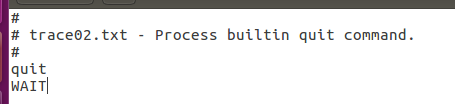

要求添加内置命令quit

#### trace03

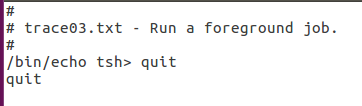

也是要求添加内置命令quit

#### trace04

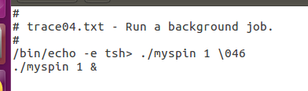

添加后台运行的功能，直接用CSAPP书上的代码，但是会有内存泄露的问题

#### trace05

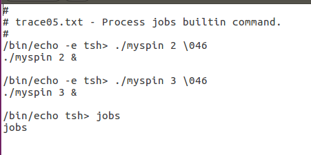

除了实现后台运行的功能，还需要实现内置命令jobs，思路与书中642页程序大致相同

#### trace06

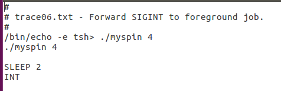

运行了一个`./myspin 4`并在两秒后对其中断，键盘按下ctrl-c后，进入信号处理函数，然后终止前台正在运行的函数。在处理函数中，需要获取前台正在运行进程的pid，而访问全局变量时最好对信号量进行阻塞。

#### trace07

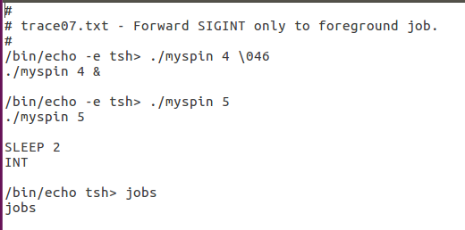

对前面两个trace的组合

#### trace08

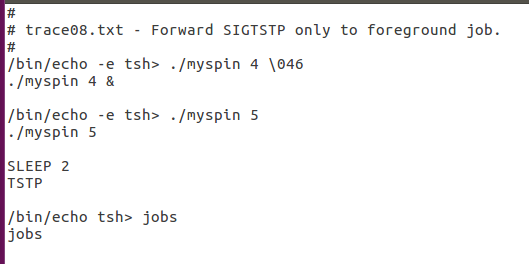

这一条测试是对前台程序进行停止（挂起），即对`sigtstp_handler`函数进行编写。该函数与`sigint_handler`几乎一模一样，只是在`kill`中的参数不同而已。

#### trace09

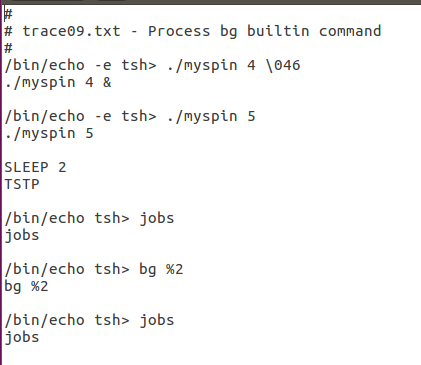

trace09是对`bg`和`fg`指令进行解析并运行。因此，这里需要完成`do_fg`函数。该函数需要做到以下几点：

- 对`bg`和 `fg`命令进行区分
- pid和jib参数的打印与错误提示

该函数的大致思路是这样的

- 首先判断输入指令是否正确
- 获取指令的pid、jid以及当前操作pid号的job结构体指针(这一步异常重要，因为输入 `fg/bg %num`指令进行操作时，是无法获取当前指令的pid的，因此更改运行状态等会遇到一些小麻烦，解决的一种方法是自己写一个`jid2pid`以及更改对应`status`的函数，这里我嫌麻烦直接就获取job的指针直接修改了)
- 利用switch语句对几种不同`status`分别进行操作（`fg`的实质就是激活后台进程在前台等待，`bg`只是简单的重启进程即可）

#### trace10

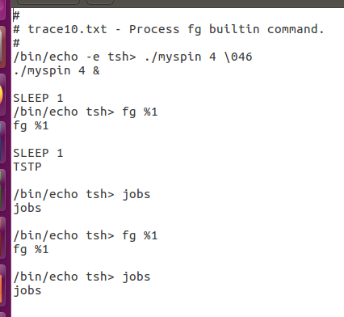

这里遇到了执行`fg %1`后程序会卡住的问题，上网一查找到了答案

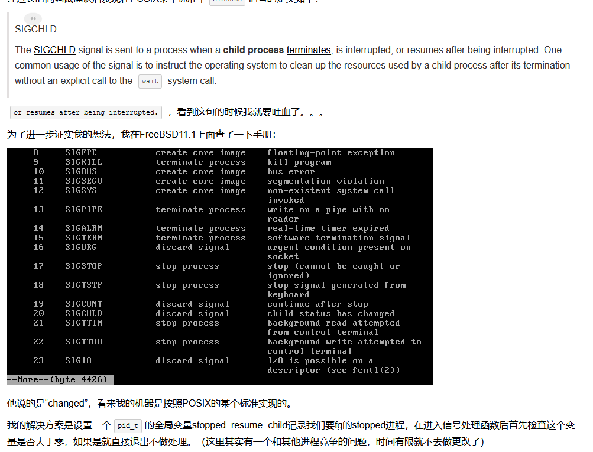

如果能过顺利完成前10个测试条例，其余的都是对之前的一些组合，基本都能通过测试。

tsh.c代码：


运行结果：

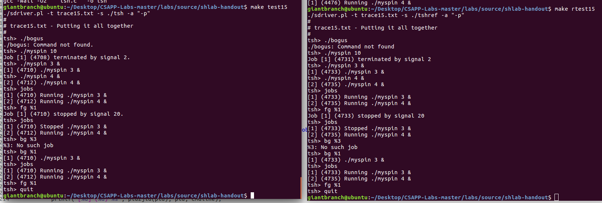